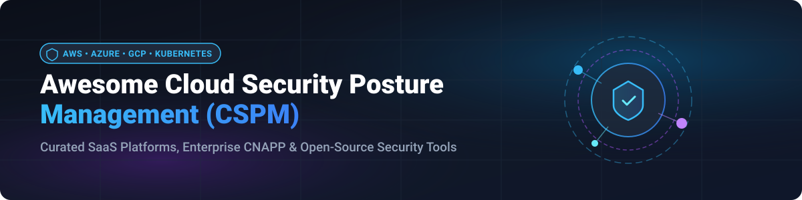
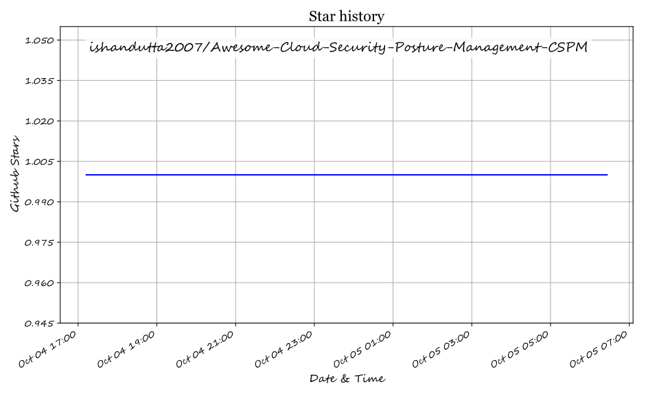

  

  
  
  
  
  

# 🛡️ Awesome Cloud Security Posture Management (CSPM)

**Curated List of SaaS Platforms & Open-Source Security Tools**  
*Focused on Cloud Misconfiguration Detection, Compliance Monitoring, CIEM, & Multi-Cloud Posture Security (AWS, Azure, GCP, Kubernetes)*  

**Last updated: October 2026**

---

This repository tracks top-tier **SaaS platforms** and **open-source projects** for **Cloud Security Posture Management (CSPM)** and **Cloud-Native Application Protection Platforms (CNAPP)**. These tools enable security teams, DevSecOps engineers, and compliance officers to continuously assess cloud configurations, detect misconfigurations, enforce compliance benchmarks (CIS, NIST, PCI DSS, HIPAA, GDPR), and prioritize remediation across multi-cloud and container environments.

---

## 📖 Table of Contents

- [☁️ SaaS / Hosted Platforms](#%EF%B8%8F-saas--hosted-platforms)
- [🔓 Open-Source GitHub Projects](#-open-source-github-projects)
- [🤝 How to Contribute](#-how-to-contribute)
- [💖 Support & Sponsorship](#-support--sponsorship)
- [📈 Star History](#-star-history)
- [⚠️ Disclaimer](#%EF%B8%8F-disclaimer)

---

## ☁️ SaaS / Hosted Platforms

> **📊 Market Context & Sector Concentration**: The global Cloud Security Posture Management (CSPM) market is estimated at **~$2.5B in 2026**, growing toward **~$7B by 2031** at a **~22% CAGR**. The sector is **moderately concentrated** at the enterprise tier — dominated by top-tier CNAPP leaders like Wiz, Microsoft Defender for Cloud, and Palo Alto Prisma Cloud, while specialized platforms like Orca Security, Tenable, and Fortinet Lacework actively compete across mid-market and enterprise workloads. No single vendor holds a winner-take-all monopoly, making multi-vendor cloud defense strategies standard practice.

| Platform | Description | Pricing (Starting Tier) | Free Tier Limits | Company Size / Revenue |
|----------|-------------|------------------------|------------------|------------------------|
| **[Microsoft Defender for Cloud](https://www.microsoft.com/en-us/security/business/cloud-security/microsoft-defender-cloud)** | **Free foundational CSPM tier** covering Azure, AWS, and GCP with secure score, security recommendations, and Microsoft Cloud Security Benchmark. **Defender CSPM** adds agentless scanning, attack path analysis, and cloud security explorer. | **Foundational CSPM**: **Free**. **Defender CSPM**: **$5.11/resource/month** (~$0.007/server/hour); container nodes at **~$0.013/vCore/hour**. | **Foundational CSPM is free forever** for all Azure, AWS, and GCP resources. **30-day free trial per plan** for Defender CSPM across connected accounts. | **~$281B revenue (Microsoft FY2025)** |
| **[Wiz](https://www.wiz.io/)** | **Agentless-first CNAPP with CSPM capabilities.** Security Graph correlates findings across compute, identity, network, data, and code. **Acquired by Google for $32B** (March 2026) after reaching **$500M revenue (2024)** and a **$12B valuation**. | Standard enterprise contract starting tier starts at **~$60,000/year** (or ~$1,500–$3,000/workload/year for 20–50 minimum workloads). | **No free-forever plan**; offers up to a **21-day guided Proof of Concept (PoC)** / free cloud risk assessment for evaluated enterprise cloud accounts. | **$32B acquisition, $500M revenue (2024), $1.9B raised** |
| **[Palo Alto Prisma Cloud](https://www.paloaltonetworks.com/prisma/cloud)** | **Most feature-complete CNAPP with mature remediation engine.** 100+ compliance frameworks, agent-based runtime blocking via **Defender agents**, and **FedRAMP High + IRAP certifications**. | Credit-based tier starts at **~$60,000/year** (or AWS Marketplace credit unit starter packages). | **No free-forever plan**; offers a **30-day free trial** covering CSPM and Cloud Workload Protection modules. | **~$9.2B revenue (Palo Alto FY2025)** |
| **[Check Point CloudGuard](https://www.checkpoint.com/)** | **Unified cloud-native security with CSPM, CWPP, and network security.** **CloudGuard revenue showed weakness in CY2024** but new business grew +10% in all geographies in Q4. | Posture Management contracts start at **~$9,000/year** (or AWS Marketplace metered pay-as-you-go starting at **~$0.06/vCore/hour**). | **No free-forever plan**; offers a **30-day free trial** across multi-cloud environments. | **$2.6B revenue (Check Point FY2024)** |
| **[Trend Micro Cloud One](https://www.trendmicro.com/)** | **Conformity / Vision One Cloud Risk Management** identifies misconfigurations and enforces security posture across cloud environments. | AWS Marketplace metered starting tier at **$0.01/hour per instance** (~$7.30/instance/month) or **$270/month** starter package. | **Free tier scans up to 20 files/hour** (File Storage Security); **30-day free trial** for Vision One / Cloud Security modules. | **~$1.8B revenue (Trend Micro FY2025)** |
| **[Orca Security](https://orca.security/)** | **Agentless CNAPP with SideScanning technology.** Reads cloud workload block storage out-of-band. **More competitive in mid-market** than Prisma Cloud. | AWS Marketplace Small tier starts at **$7,000/month ($84,000/year)** for up to 250 workloads. | **No free-forever plan**; offers a **30-day free trial / cloud risk assessment** via AWS Marketplace. | **$1–2.5B valuation, $100–500M revenue** |
| **[Tenable Cloud Security](https://www.tenable.com/)** | **Best-in-class dedicated CIEM, now integrated into Tenable's exposure management platform.** Acquired Ermetic to add cloud identity security. | Entry enterprise contracts start at **$50,000/year** for up to 500 billable assets (~$100/asset/year). | **No free-forever plan**; offers a **30-day requested free trial / proof of concept** managed via sales. | **~$900M revenue (Tenable FY2025 est.)** |
| **[Rapid7 InsightCloudSec](https://www.rapid7.com/)** | **Consumption-based CSPM with self-hosted, managed, or SaaS deployment options.** Priced on average billable resources across cloud environment. | Developer license tier starts at **$6,000/year**; full enterprise tier starts at **$66,000/year** for 500 resources ($132/resource/year). | **No free-forever plan**; offers a **30-day free trial** upon request for evaluation. | **~$800M revenue (Rapid7 FY2025 est.)** |
| **[Lacework (FortiCNAPP)](https://www.lacework.com/)** | **Polygraph behavioral analytics platform.** **Acquired by Fortinet in 2024 for $152.3M**. Now ships as **Lacework FortiCNAPP** integrated into Fortinet's security fabric. | FortiCNAPP vCPU starter packages begin at **~$22,000/year** (Standard starter pack) or **$0.01–$0.06/instance/hour** metered. | **No free-forever plan**; offers a **14-day free trial / cloud security assessment** via AWS Marketplace. | **$152.3M acquisition (Fortinet), ~$600M raised pre-acquisition** |

---

## 🔓 Open-Source GitHub Projects

Sorted by Stars_Count (descending). Stars_Badge links directly to each repository's stargazers page.

| Repo | Description | GitHub_Stars |
|------|-------------|-------|
| **[Trivy](https://github.com/aquasecurity/trivy)** | **Comprehensive multi-scanner for cloud & containers.** Vulnerabilities, misconfigurations (IaC), secrets, and SBOM scanner for containers, Kubernetes, AWS, and repositories. Apache-2.0. |  |
| **[Prowler](https://github.com/prowler-cloud/prowler)** | **Most widely used open-source CSPM.** Multi-cloud auditing for AWS, Azure, GCP, Kubernetes, M365, GitHub, Okta with **800+ checks** mapped to CIS, NIST, PCI DSS, HIPAA, GDPR. Apache-2.0. |  |
| **[Steampipe](https://github.com/turbot/steampipe)** | **Zero-ETL cloud query engine.** Query live cloud APIs using SQL without databases. 150+ plugins covering AWS, Azure, GCP, Kubernetes, and GitHub. Surface idle resources and misconfigurations. AGPL-3.0. |  |
| **[Checkov](https://github.com/bridgecrewio/checkov)** | **Infrastructure as Code (IaC) static analysis.** Scans Terraform, CloudFormation, Kubernetes, ARM, and Serverless framework for security misconfigurations. Apache-2.0. |  |
| **[ScoutSuite](https://github.com/nccgroup/ScoutSuite)** | **Multi-cloud security auditing by NCC Group.** Supports AWS, Azure, GCP, Alibaba Cloud, OCI. Rule-based findings with severity scoring and interactive HTML reports. GPL-2.0. |  |
| **[Kube-Bench](https://github.com/aquasecurity/kube-bench)** | **Kubernetes CIS Benchmark auditor.** Checks whether Kubernetes is configured securely according to the CIS Kubernetes Benchmark. Apache-2.0. |  |
| **[Cloud Custodian](https://github.com/cloud-custodian/cloud-custodian)** | **CNCF Incubating governance engine.** YAML-based DSL for real-time cloud policy enforcement, off-hours scheduling, and automated remediation. Apache-2.0. |  |
| **[Terrascan](https://github.com/tenable/terrascan)** | **Static code analyzer for IaC.** Detects security vulnerabilities and compliance violations across Terraform, Kubernetes, Helm, Kustomize, and ARM templates. Apache-2.0. |  |
| **[Pacu](https://github.com/RhinoSecurityLabs/pacu)** | **AWS exploitation and security auditing framework.** Open-source AWS penetration testing tool by Rhino Security Labs for testing cloud security posture defenses. BSD-3-Clause. |  |
| **[Cloudsploit](https://github.com/aquasecurity/cloudsploit)** | **Open-source CSPM engine by Aqua Security.** Automated security scanning for AWS, Azure, GCP, and Oracle Cloud environments. GPL-3.0. |  |
| **[Cartography](https://github.com/lyft/cartography)** | **Graph-based cloud asset consolidation by Lyft.** Consolidates infrastructure assets and user permissions into a Neo4j graph for intuitive security attack path analysis. Apache-2.0. |  |
| **[Cloudsplaining](https://github.com/salesforce/cloudsplaining)** | **AWS IAM policy assessment tool by Salesforce.** Identifies overprivileged IAM policies and highlights risk areas such as privilege escalation and data exfiltration. MIT. |  |
| **[CloudFox](https://github.com/BishopFox/cloudfox)** | **Automated cloud attack surface discovery by Bishop Fox.** Command-line tool for discovering reachable attack paths in AWS and Azure environments. MIT. |  |
| **[ZeusCloud](https://github.com/Zeus-Labs/ZeusCloud)** | **Open-source CNAPP & CSPM platform.** Agentless cloud security platform with attack path visualization and security graph analytics. Apache-2.0. |  |
| **[CloudGuard CSPM Calculator](https://github.com/CheckPointSW-Community/CloudGuard-CSPM-Calculator)** | **Check Point community tool** to estimate cloud asset counts and sizing for CSPM deployments. MIT. |  |
| **[CloudGuard CLI](https://github.com/limebrew-org/cloudguard)** | **Python CLI CSPM audit utility** for rapid misconfiguration checks across GCP, AWS, and Azure. Apache-2.0. |  |

---

## 🤝 How to Contribute

1. Fork the repository on GitHub.
2. Add/update entries in `README.md` following the established table structure.
3. Ensure entries include factual descriptions, official links, transparent starting pricing, and exact free tier/trial limits.
4. For curated awesome lists, check out [Awesome-Awesome-Awesome](https://github.com/ishandutta2007/Awesome-Awesome-Awesome).
5. Submit a pull request with a brief explanation of your additions.

---

## 💖 Support & Sponsorship

If you find this CSPM repository useful for your cloud security architecture, research, or DevSecOps workflow:

- 🌟 **Star this repository** to help others discover it!
- 🔀 **Fork & Share** it with your security team and peers.
- ☕ **Support the maintainer**: Consider buying a coffee or sponsoring future security research via the [Sponsor Dashboard](https://github.com/sponsors/ishandutta2007).

---

## 📈 Star History

---

## ⚠️ Disclaimer

- This is a **community-curated list** — not exhaustive and not a commercial endorsement.
- CSPM platforms handle critical cloud infrastructure access; enforce strict IAM role scoping and follow least-privilege principles when conducting audits.
- **Open-source reality**: Open-source CSPM solutions (**Prowler**, **Trivy**, **Steampipe**, **Cloud Custodian**) offer production-grade audit capabilities. However, enterprise SaaS platforms provide managed scanning infrastructure, automated attack path graphing, and SOC integration out-of-the-box.
- **Pricing note**: All pricing figures are verified against official documentation, marketplace listings, and industry benchmarks as of October 2026, but are subject to change by vendors.

---

  <b>Made for Cloud Security Architects, SOC Analysts, DevSecOps Engineers, &amp; Compliance Leads.</b>

## ⭐ Star History

<a href="https://star-history.com/#ishandutta2007/Awesome-Cloud-Security-Posture-Management-CSPM&Timeline" align="center">
  <picture>
    <source media="(prefers-color-scheme: dark)" srcset="assets/ishandutta2007_Awesome-Cloud-Security-Posture-Management-CSPM_growth.svg">
    
  </picture>
</a>
